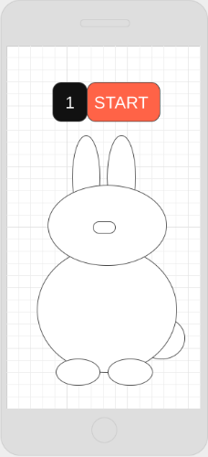

# Project #1 - Sonny Says

## User Story

As a user, I want to play a fun and interactive single player game with clear instructions that gives instant feedback on whether I win or lose.

## Solution

Sonny Says is my creative approach to the Simon Says game. Sonny the Bunny highlights a body part and the player repeats the sequence until they either get it wrong or win the game. It explores CSS animation, game logic with Vanilla JavaScript and dom manipulation.

### Acceptance Criteria:

- Single player game
- Clear instructions
- Interactive
- Win/Loss case

## Wireframes

## Technologies Used

Sonny Says was created using html5, css3, and vanilla javascript logic and dom manipulation

## Approach taken

1. The first thing I tackled was the html and css. Because I'm a visual person, I found it easier to manipulate elements I could see. One big part of my project was testing myself with css animations, so I spent a lot of time working on those.

- I created moving clouds and grass using keyframe animations
- I created my bunny using nested div elements, manipulated with border radii.
  Once I had the basic site setup and the body parts of my bunny, I began to work on the javascript.

2. The first thing the javascript does is create the setup for a new game. It locates all the possible moves, and readies the timer, round counter, and empty computer sequence array.
3. Using the click event listener, the game is initiated when the player clicks start.
4. First, the computer pushes a random move into its array and visually cues the player to repeat.
5. It then listens for the player's clicks until the player's array (the player starts each round with an empty array) has the same length as its own.
6. Once the two arrays are equal in length, the computer evaluates if the elements in each index are the same.
7. If they are the same, the computer moves on to the next round until the player correctly repeats all 10 moves at which point it displays a win. Then it restarts the game.
8. If they are not the same, the computer displays a loss and restarts the game.

## How-to-use Instructions

### Objective

The objective of the game is to correctly repeat a longer and longer sequence of movements.

1. Press the START button. Sonny will give the first moevement. Repeat the movement by pressing the same body part.
2. Sonny will duplicate the first movement and add one. Repeat these two movements by pressing the same body parts.
3. Sonny will duplicate these first two movements and add one.
4. Continue playing as long as you can repeat each sequence of movements correctly. If you get all 10 movements in the sequence, you win.
5. If you fail to repeat a sequence exactly, Sonny responds with 'uh oh!'. This means you've lost, and the sequence of movements ends.

## Unsolved Problems

- The game is created using global variables. Once I tried to change my variable declarations to const and let, it got wonky.
- I think the only class I used was Audio. I couldn't figure out how to create a class since every function was interdependent.
